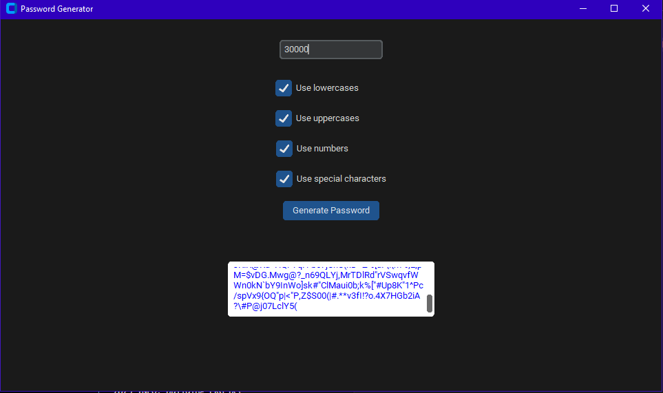

## Project State
Functionnal : you can generate a password of desired length from a .exe file and choose with check boxes what characters the password has.
# Project Motivation
- I know there exist reliable and secure software that generates and store securately passwords, I would recommend to check : https://github.com/Lissy93/awesome-privacy and Dashlane or Bitwarden for your personnal use.
- However, I like creating applications with UI and I want to improve at it. So I need no more reasons not to try to make (some) things myself 🤠 ! 
## Project Goals
1. Create a basic .exe app to generate random passwords of desired length. ✅
2. Add settings property such as choosing if the password has numbers, uppercase, lowercase, special characters. ✅
3. Added some testing with pytest / tox and automatic testing with github actions. ✅

## Project Result
Currently (v2) we can generate a 'customized' password. We can choose its length and some of the characters that it posess (lower, uppercase, numbers, special characters).
It was exactly what I wanted.
This is the current result of this project :

Note : last updated version is not in the .exe file but they have no differences in terms of functionnality, the code has just been 'refactored' using a class.

